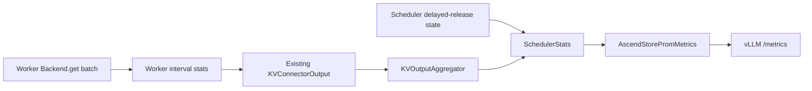

# RFC: AscendStore KV Pool Metrics

> **Status:** Draft
>
> **Target:** vLLM Ascend 0.27
>
> **Audience:** vLLM Ascend maintainers and operators of AscendStore KV pools

This RFC proposes four AscendStore metric families. Two Gauges report the
current scheduler state: how many completed requests still retain KV blocks
while waiting for save completion, and how many block references they retain.
A Histogram and a Counter report non-layerwise backend GET latency and key
volume. The design reuses vLLM's connector-statistics pipeline, adds no metrics
RPC, avoids request-ID labels, and keeps Prometheus work outside transfer
threads.

For the surrounding KV pool architecture, see the
[KV Cache Pool Guide](KV_Cache_Pool_Guide.md). For the separate layerwise
offload protocol, see
[Layerwise and Sparse KV Cache Offloading Design](layerwise_and_sparse_kv_cache_offloading.md).

## 1. Motivation

AscendStore can retain a completed request's local KV blocks until every
worker reports that the request's asynchronous save has finished. Existing
service metrics do not show whether this retention is happening or how much KV
capacity it holds. Operators therefore cannot distinguish normal KV cache
usage from memory pressure caused by delayed release.

Remote KV loads also need enough telemetry to answer two operational
questions:

- How long does an AscendStore backend GET batch take in a recent time window?
- How many keys does that workload submit to the backend?

The delayed-release state is the primary requirement. GET telemetry is
secondary and must not add material overhead to the transfer path.

## 2. Goals and non-goals

### Goals

- Expose the current number of completed requests waiting to release KV
  blocks.
- Expose the current number of KV block references retained by those requests.
- Measure completed non-layerwise `Backend.get` batch latency and submitted key
  volume.
- Reuse vLLM's standard `/metrics` endpoint and connector-statistics
  aggregation.
- Preserve bounded steady-state memory and avoid NPU synchronization.
- Keep the design compatible with later operation-level metrics when a concrete
  requirement exists.

### Non-goals

- Expose request IDs or per-request block counts as Prometheus labels.
- Count how many requests have ever experienced delayed release.
- Preserve every GET sample for the lifetime of the process.
- Measure request end-to-end load latency, cache-hit ratio, transferred bytes,
  or failed keys.
- Measure layerwise GET or `batch_copy` latency in this version.
- Add an AscendStore-specific RPC, background metrics thread, or in-process
  rolling-window implementation.

The first non-goal is intentional. Request IDs are unbounded, so using them as
labels would create high-cardinality time series and eventually burden both
the serving process and Prometheus. Debug logging may identify a request, while
metrics quantify current service-level impact.

## 3. Metric contract

The proposal adds four metric families. The `engine` and `model_name` labels
come from vLLM's existing per-engine metric infrastructure.

| Metric family | Type | Value | Time semantics |
| :--- | :--- | :--- | :--- |
| `vllm:ascend_store_delayed_release_requests` | Gauge | Completed logical requests whose KV blocks remain retained while waiting for AscendStore save completion | Current absolute state; rises and falls |
| `vllm:ascend_store_delayed_release_blocks` | Gauge | Local KV block references retained by those requests; hybrid KV cache groups are summed | Current absolute state; rises and falls |
| `vllm:ascend_store_load_get_duration_seconds` | Histogram | One observation for each non-layerwise worker `Backend.get` batch that returns without raising | Cumulative bucket, count, and sum series since process start |
| `vllm:ascend_store_load_get_keys_total` | Counter | Keys submitted to those completed GET batches, summed across workers | Cumulative since process start |

The two delayed-release Gauges must be read together. The request Gauge shows
the affected request scale; the block Gauge shows KV capacity pressure. A
block-only metric cannot distinguish one large request from many smaller
requests.

The delayed-release metrics intentionally have no Counter counterpart. A
cumulative transition count does not answer the primary question, which is
whether completed requests are retaining KV blocks now.

### Histogram output

The GET Histogram uses these explicit upper bounds, in seconds:

```text
0.001, 0.005, 0.01, 0.05, 0.1, 0.2, 0.3, 0.4, 0.5,
0.75, 1.0, 1.5, 2.0, 3.0, 4.0, +Inf
```

Prometheus exposes the Histogram as:

- `vllm:ascend_store_load_get_duration_seconds_bucket`;
- `vllm:ascend_store_load_get_duration_seconds_count`; and
- `vllm:ascend_store_load_get_duration_seconds_sum`.

For example, the bucket with `le="0.01"` is the cumulative number of observed
GET batches that completed in at most 10 ms. The buckets make windowed
quantiles possible; `_sum` and `_count` alone provide only a windowed average.

The Prometheus Python client may also expose `_created` series for the
Histogram and Counter. Those timestamps are client-generated metadata and are
not part of this RFC's operational contract.

## 4. Design

### 4.1 Reuse the vLLM connector-statistics pipeline

The implementation follows the extension points already used by upstream
connectors such as Mooncake Store:

1. the connector returns a serializable `KVConnectorStats` object;
2. vLLM places worker stats in the existing `KVConnectorOutput`;
3. `KVOutputAggregator` combines outputs from all workers;
4. the scheduler merges worker observations with scheduler-side state;
5. the stat logger passes the payload to the connector's
   `KVConnectorPromMetrics`; and
6. the normal vLLM HTTP endpoint exposes the registered series at `/metrics`.



Scraping `/metrics` only reads the Prometheus registry in the serving process.
It does not synchronously query workers or trigger a collective RPC.

### 4.2 Track delayed release at the scheduler

The scheduler owns block allocation and the decision to delay block release,
so it is the authoritative source for both delayed-release Gauges.

When a non-layerwise request finishes and has KV data to save,
`request_finished()` or `request_finished_all_groups()` returns that release
must be delayed. At the same transition, the connector records:

- the request ID in a set used by the existing completion protocol;
- the request's retained block-reference count in a map; and
- an O(1) running total of retained block references.

The stats payload receives the set size and running total only when a request
enters or leaves the delayed state. It does not rescan all requests every step.

When worker output reports `finished_sending`,
`update_finished_sending()` removes the request and publishes the new absolute
Gauge values. Duplicate or stale completion notifications do not change the
state.

The delayed state excludes these paths:

- a load-only `kv_consumer`, because it does not publish KV;
- layerwise transfer, because it uses per-layer buffer reuse gates and does not
  publish the non-layerwise request-level sending event;
- a request with no saved tokens; and
- a request with no retained blocks.

### 4.3 Preserve all-worker completion semantics

Each worker reports completed sends through the existing model-runner output.
`KVOutputAggregator` keeps a remaining-worker count per request and emits the
request in aggregated `finished_sending` only after every expected worker has
reported it. The scheduler therefore keeps both Gauges nonzero when even one
worker is late.

GET observations have different aggregation semantics. Each worker contributes
one Histogram observation per backend batch and its submitted key count.
For example, if two tensor-parallel workers each perform one 5 ms GET with
eight keys, the final metrics add two observations and 16 keys. They do not
invent a single request-level 5 ms or 10 ms sample.

### 4.4 Explain `wait_for_save()` and the next-step window

For the non-layerwise path, `wait_for_save()` enqueues the current step's save
work and calls `request_queue.join()`. The join waits until the worker transfer
thread marks those queue items done. It does not bypass the scheduler's
request-finish and all-worker completion protocol.

The metadata used by a worker in step N was built before step N executes, so it
cannot yet identify a request that will generate its final token in that step
as delayed. The worker may finish the save and retain its completion marker,
but the scheduler only calls `request_finished()` after processing step N's
model output. A later step or no-forward cycle carries the delayed request ID
back to workers, allows their retained completion markers to be aggregated,
and then clears the delayed state.

Consequently, delayed release can occur even when `request_queue.join()` has
already returned. The Gauge measures the scheduler-visible lifetime of retained
blocks, not only backend execution time. If completion is consumed quickly,
the nonzero interval may be shorter than a Prometheus scrape interval.

### 4.5 Record GET latency at backend-batch granularity

The synchronous, asynchronous, and tensor-parallel-mismatch non-layerwise load
paths use the same recording boundary:

1. read `time.perf_counter()` immediately before `Backend.get`;
2. invoke one backend batch GET;
3. read the clock again after the call returns; and
4. record elapsed seconds and `len(keys)` once for the whole batch.

The measurement includes only the backend call. It excludes key/address
construction, scheduling delay, result processing, worker aggregation, and
subsequent model computation.

If `Backend.get` raises, the call produces no ordinary latency or key sample.
If it returns normally with per-key failure codes, it is still a completed
backend call and the implementation records its total duration and submitted
keys. The key Counter therefore means submitted keys, not successful, unique,
or cache-hit keys.

### 4.6 Keep transient stats bounded

Each worker stores elapsed-time floats only between two stats collections. On
each model-runner finalize cycle, `get_stats()` swaps the current stats object
for a new empty object under a short lock. It does not copy the observation
list. vLLM then transports the old object through the existing output path.

Prometheus does not retain every float. A Histogram folds observations into a
fixed set of bucket counters plus `_sum` and `_count`. Those cumulative numbers
grow during the process lifetime and reset on process restart, as standard
Prometheus Counters and Histograms do. Operators derive recent behavior with
`rate()` or `increase()`.

Scheduler stats use the same object-swap interface but need no lock because
their state transitions and collection run serially on the scheduler thread.
During aggregation, GET lists are appended and key increments are summed. A
scheduler delayed-state payload replaces the previous Gauge snapshot only when
it contains delayed-release fields, so worker-only stats cannot overwrite the
authoritative scheduler value.

### 4.7 Align with upstream metrics RFCs

This proposal follows the direction established in upstream vLLM discussions:

- The [vLLM metrics design](https://github.com/vllm-project/vllm/blob/main/docs/design/metrics.md)
  defines Gauge as current state, Counter as a monotonic process-lifetime
  value, and Histogram as bucketed observations exposed through `/metrics`.
- [Offloading Metrics Redesign RFC #44008](https://github.com/vllm-project/vllm/issues/44008)
  makes connector aggregation semantics explicit: Counters sum, Gauges keep
  the latest value, and Histograms accumulate observations. It also requires
  scheduler-side stats to be collected after worker output is applied. This
  proposal uses both rules.
- [NIXL aggregation documentation issue #41230](https://github.com/vllm-project/vllm/issues/41230)
  shows why multi-rank sample granularity must be documented. Section 4.3
  therefore states that GET observations are worker backend batches, not
  logical requests.
- [Mooncake Store Connector RFC #38474](https://github.com/vllm-project/vllm/issues/38474)
  uses the same scheduler/worker split and background transfer model that
  AscendStore follows.

[Generalize Connector Metrics RFC #53484](https://github.com/vllm-project/vllm/issues/53484)
proposes a declarative metric-metadata API in the connector base. The vLLM API
targeted by this RFC exposes `build_prom_metrics()` but does not yet provide
that generic registration implementation. AscendStore therefore registers all
four metric families up front in its connector-specific adapter. If the
upstream metadata API becomes available in a future supported vLLM version,
the adapter can migrate without changing the scheduler state machine, worker
recording boundary, metric names, or public semantics.

This RFC does not build a second declarative framework in vLLM Ascend while the
upstream proposal is still evolving.

## 5. Performance constraints

The design keeps the backend hot path independent of Prometheus. One completed
GET batch adds:

- two CPU `time.perf_counter()` reads;
- one callback;
- one short `threading.Lock` acquisition;
- one float append; and
- one integer addition.

The lock does not cover `Backend.get`, does not run once per key, and performs
no tensor access. The implementation adds no `tensor.item()`, CPU-to-NPU copy,
device synchronization, label construction, serialization, or network call to
the hot path. Prometheus `observe()`, `inc()`, and `set()` run after aggregation
in the logger process.

The current implementation deliberately keeps a compact operation recorder
instead of copying Mooncake Store's richer status/bytes/failed-key record for
every batch. The generic `record_operation` boundary remains available for a
future operation, but no unused labels or payload fields are allocated today.

## 6. Querying the metrics

A direct HTTP scrape returns the current Gauge values and process-lifetime
Histogram/Counter accumulators:

```bash
curl -s http://127.0.0.1:8000/metrics | grep 'vllm:ascend_store'
```

The raw response does not contain a one-minute or five-minute history. A
Prometheus server or another scraper must retain samples to evaluate range
queries.

Current delayed-release state requires no `rate()`:

```promql
vllm:ascend_store_delayed_release_requests
vllm:ascend_store_delayed_release_blocks
```

Recent GET key rate:

```promql
sum by (engine, model_name) (
  rate(vllm:ascend_store_load_get_keys_total[5m])
)
```

Recent mean backend-batch GET latency:

```promql
sum by (engine, model_name) (
  rate(vllm:ascend_store_load_get_duration_seconds_sum[5m])
)
/
sum by (engine, model_name) (
  rate(vllm:ascend_store_load_get_duration_seconds_count[5m])
)
```

Recent p95 backend-batch GET latency:

```promql
histogram_quantile(
  0.95,
  sum by (le, engine, model_name) (
    rate(vllm:ascend_store_load_get_duration_seconds_bucket[5m])
  )
)
```

Deployments with multiple scrape targets should retain the Prometheus
`instance` label unless intentionally aggregating across service instances.

Gauge sampling has a normal observability limitation: a state that enters and
leaves entirely between two scrapes is not present in either sample. A shorter
scrape interval improves visibility. If operators later require an audit trail
of every transition, that is a separate event-log or cumulative-Counter
requirement rather than a reason to change the current-state Gauge semantics.

## 7. Alternatives considered

### Logs only

Debug logs can identify request IDs, but they do not provide a cheap current
aggregate, standard dashboard query, or alerting source. Logs remain useful for
drill-down after a Gauge indicates pressure.

### Only a delayed-block Gauge

This is smaller but loses request scale. Ten retained blocks could represent
one request or ten requests, which have different operational implications.

### A cumulative delayed-request Counter

This records historical transitions but does not answer whether any request is
blocked now. It also cannot measure current capacity pressure. The proposal
does not add it.

### Request ID as a Prometheus label

This would expose per-request detail directly but creates an unbounded time
series for every request. The cardinality and memory cost conflict with the
performance requirement.

### Last-GET-latency Gauge

A last-value Gauge is unstable under concurrent workers and does not support a
meaningful average or percentile. A standard Histogram preserves bounded
memory and supports arbitrary query windows.

### An in-process rolling window

Maintaining one-minute samples in every worker duplicates Prometheus and adds
expiration work, clocks, and state to the service. Monotonic Histogram/Counter
series let the monitoring system choose the window instead.

### Copy the full upstream Mooncake Store schema

Mooncake Store records operation, status, bytes, and failed-key dimensions for
several RPC types. That model is a useful extension reference, but allocating
those records and labels for a single required GET operation is unnecessary.
This proposal preserves the same connector interfaces and timing pattern while
recording only required fields.

## 8. Validation plan and evidence

The implementation requires unit coverage for:

- stats aggregation, including additive GET values and latest delayed state;
- Prometheus routing to Gauge, Histogram, and Counter objects;
- delayed-state entry, all-group block counting, and completion cleanup;
- active scheduler/worker role routing; and
- successful versus raised `Backend.get` calls.

The current prototype produced the following validation evidence:

| Validation | Result |
| :--- | :--- |
| AscendStore unit tests on the 0.27 development branch | 319 passed |
| Ruff, format, and Python compile checks | Passed |
| Compatibility-container AscendStore unit tests | 395 passed, 10 skipped |
| Live vLLM `/metrics` endpoint | All four metric families present |
| Real Mooncake GET workload | 96 worker batches, 768 keys, 0.421516 s cumulative GET time |
| Delayed-release fault injection | Peak 1 request and 37 retained block references |
| GET recorder microbenchmark | Approximately 0.907 microseconds per backend batch |
| End-to-end GET A/B throughput | Instrumented median was 0.30% below control, within observed run-to-run variation |

The A/B result does not prove zero overhead for every workload. It shows no
distinguishable regression in the tested workload and supports the expected
sub-microsecond recording cost relative to a backend batch call.

The delayed-release test temporarily withheld scheduler consumption of
`finished_sending` to make the state outlive the scrape interval. The production
implementation contains no sleep, fault-injection switch, or dropped
completion notification.

## 9. Compatibility and rollout

The metrics are additive. They do not change configuration, backend protocol,
request outputs, or the `/metrics` endpoint contract. Runtime cost is limited
to the state-transition and GET-recording work described in Section 5.

The initial implementation covers non-layerwise AscendStore. Layerwise
offloading has different operation boundaries and completion semantics. A
follow-up may reuse `record_operation`, but it should first define whether the
stable unit is one layer `Backend.get`, one `batch_copy`, or one logical
request. Layerwise observations must not be mixed into the existing Histogram
unless they preserve its backend-batch meaning.

Future extensions such as PUT latency, status, transferred bytes, or failed
keys should follow the same rule: add a metric only with a defined operational
question, stable sample granularity, and measured hot-path cost.

## 10. Implementation references

- [Connector stats and Prometheus adapter](../../../../vllm_ascend/distributed/kv_transfer/kv_pool/ascend_store/metrics.py)
- [Connector extension points](../../../../vllm_ascend/distributed/kv_transfer/kv_pool/ascend_store/ascend_store_connector.py)
- [Scheduler delayed-release state](../../../../vllm_ascend/distributed/kv_transfer/kv_pool/ascend_store/pool_scheduler.py)
- [Worker GET recording and stats snapshots](../../../../vllm_ascend/distributed/kv_transfer/kv_pool/ascend_store/pool_worker.py)
- [Asynchronous transfer timing](../../../../vllm_ascend/distributed/kv_transfer/kv_pool/ascend_store/kv_transfer.py)
- [Metrics unit tests](../../../../tests/ut/distributed/ascend_store/test_metrics.py)
