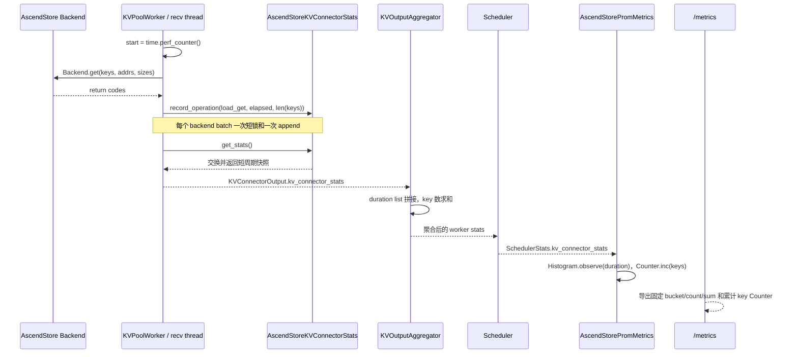
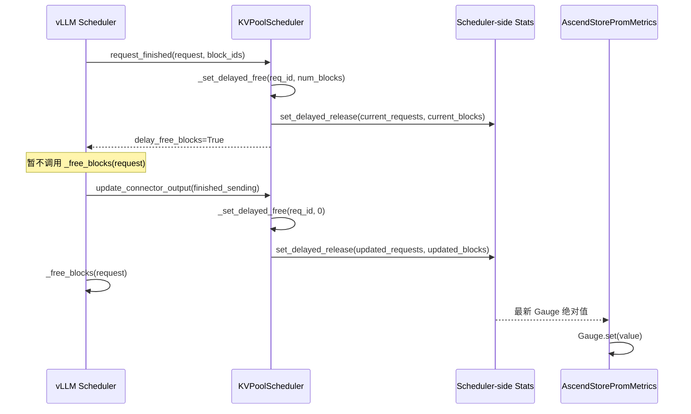

<!-- markdownlint-disable-next-line MD025 -->
# AscendStore KV Pool 指标实现逐行说明

本文解释 `feat/ascend-store-request-metrics` 相对 `releases/v0.27.1rc` 的每处源码和测试改动。读完后，你可以判断每个 Python 语句为什么存在、数据如何从 worker 到达 `/metrics`、四组 Prometheus 指标各自表示什么，以及 `wait_for_save()` 已调用 `Queue.join()` 时为什么仍可能出现 delayed release。

## 1. 结论与适用边界

本实现增加两类观测：Scheduler 侧的当前延迟释放状态，以及 worker 侧非 layerwise `Backend.get()` 的耗时和 key 数。它没有增加每请求 label、后台线程、额外 RPC、NPU 同步或逐 key 锁。

| 问题 | 结论 |
|---|---|
| `wait_for_save()` 已经 `join()`，还会 delayed release 吗？ | 会。非 layerwise 请求可能先完成保存、随后才由 Scheduler 判断请求结束；当前 step 的 `get_finished()` 无法用尚未进入 delayed 集合的请求 ID 完成匹配，因此 Scheduler 可能到下一 step 才释放 block。正常窗口通常很短。 |
| delayed Gauge 是否等价于“后端此刻仍在执行 save”？ | 不完全等价。它精确表示“Scheduler 已结束请求，但仍按 connector 协议保留其 KV block，尚未消费 `finished_sending`”。保存可能仍在进行，也可能已完成但完成通知尚未在正确的 Scheduler 阶段被消费。 |
| 当前 delayed 指标覆盖 layerwise 吗？ | 不覆盖。`request_finished()` 和 `request_finished_all_groups()` 在 `use_layerwise=True` 时明确立即释放并将 delayed 状态清零。 |
| GET 耗时是请求级吗？ | 不是带 `request_id` 的逻辑请求明细。一个 observation 表示“一个 worker 完成一次非 layerwise `Backend.get()` batch”的耗时。TP=2 时，一个逻辑请求通常贡献两个 worker observation。 |
| `/metrics` 是否保存每次 GET 明细？ | 不保存。worker 在两个采集点之间短暂保存 duration 列表；Prometheus Histogram 最终只保存固定 bucket 计数、`_sum` 和 `_count`。 |
| 指标会增加额外 worker RPC 吗？ | 不会。stats 复用每个 model step 已有的 `ModelRunnerOutput/KVConnectorOutput` 汇聚通道。 |

代码比较基线和最终版本如下。文中的“新增”与“替换”均以这两个提交之间的 diff 为准。

| 项目 | 值 |
|---|---|
| 基线分支 | `origin/releases/v0.27.1rc` |
| 基线提交 | `ff02be1e1ffc87d4b8135bca99a93f7d283067c9` |
| 指标代码提交 | `b6cacd648f7779c19df7dc884c1fa98427c9c347` |
| 改动范围 | 5 个运行时源码文件、5 个单测文件 |
| 运行时模式 | delayed：非 layerwise save 路径；GET：非 layerwise sync、async 和 TP mismatch 路径 |

## 2. 端到端数据流

四个指标共用 vLLM 的 KV Connector stats 扩展点，但 delayed state 与 GET event 的数据源不同。Scheduler 产生 delayed 当前状态，worker 产生 GET 离散事件。

### 2.1 GET 耗时上报链路

一次 GET observation 从 worker 热路径进入短周期 stats，随后由已有 worker 输出通道汇聚，并最终写入 API/logger 进程中的 Prometheus Histogram。



这条链路包含三种不同的时间范围，必须分开理解。

| 层级 | 保存内容 | 保存多久 | 内存是否随进程总请求数增长 |
|---|---|---|---|
| worker `AscendStoreKVConnectorStats` | 每次 GET 的 float duration 和当前周期 key 总数 | 通常到本 model step 的 `get_stats()`；函数用新对象替换旧对象 | 否；只与一次采集间隔内的 GET 数相关 |
| 文本日志 accumulator | 日志周期内的 stats，用于计算 `load_get_avg_ms` | 到下一次周期日志输出后 reset | 否；只与日志周期内的 GET 数相关 |
| Prometheus Histogram | 固定 bucket 计数、`_sum`、`_count` | 指标进程生命周期 | 数字累计，但 bucket 数量和内存固定 |

### 2.2 delayed release 上报链路

delayed 指标不从 worker 计数。Scheduler 在决定是否立即释放请求 block 时维护请求集合、每请求 block 数和 O(1) 总数。



`_delayed_free_req_ids` 保证请求数不重复，`_delayed_free_blocks_by_req` 保存释放时需要扣除的 block 数，`_num_delayed_free_blocks` 避免每次更新 Gauge 时遍历整个字典求和。

### 2.3 `wait_for_save().join()` 与 delayed release 的真实关系

`send_thread.request_queue.join()` 等待的是 Python `queue.Queue` 的 unfinished-task 计数归零。它不是 `Thread.join()`：发送线程仍继续运行；只有所有已入队任务对应的 `task_done()` 被调用，`Queue.join()` 才返回。

非 layerwise 发送线程的处理顺序是：

1. `wait_for_save()` 把本 step 可保存请求放进 send queue。
2. send thread 执行 `_handle_stored_request()`，并在完成后把请求加入 `finished_requests`。
3. send thread 在 `finally` 中调用 `request_queue.task_done()`。
4. `request_queue.join()` 发现所有任务都 `task_done()` 后返回。
5. ModelRunner 随即调用 `get_finished(scheduler_output.finished_req_ids)`。

问题出在第 5 步的请求集合时序，而不是 send queue 是否完成。当前 step 新生成 EOS/stop token 的请求，在 Scheduler 处理 ModelRunner 输出之前还没有进入 Scheduler 的 delayed 集合；worker 收到的 `meta.delayed_free_req_ids` 是本 step 开始前构造的快照。因此 `get_finished()` 只返回：

```python
done_sending = self.kv_send_thread.get_and_clear_finished_requests(
    meta.delayed_free_req_ids
)
```

刚在这个 step 完成保存、又刚在这个 step 生成最终 token 的请求，虽然已经位于 send thread 的 `finished_requests`，却不在旧的 `meta.delayed_free_req_ids` 中。它不会在这一次 `get_finished()` 中被取走。

Scheduler 收到模型输出后才执行以下动作：

1. 判断请求结束。
2. 调用 connector `request_finished()`。
3. 将请求加入 `_delayed_free_req_ids`，并保留 block。
4. 在下一个调度反馈周期把该集合放进 connector metadata。
5. worker 用新的 delayed 集合匹配此前保留在 `finished_requests` 中的请求。
6. 多 worker aggregator 等全部预期 worker 都报告完成。
7. Scheduler 消费 `finished_sending`，清除 Gauge，并真正释放请求 block。

因此，`join()` 可以缩短实际 save in-flight 时间，却不消除 Scheduler/worker 两阶段协议产生的 delayed 状态。正常情况下，这个状态可能只持续一个快速调度反馈周期，Prometheus 以 15 秒等常规间隔抓取时可能完全看不到瞬时非零值。保存异常、worker 迟到、完成通知未汇聚或 Scheduler 未消费通知时，Gauge 才会持续非零并稳定可见。

以下边界必须保留在告警解释中。

| 场景 | `wait_for_save()` 行为 | delayed 行为 |
|---|---|---|
| 非 layerwise `kv_producer` / `kv_both` | 入队后 `Queue.join()` | 可能出现短暂 delayed；异常反馈时可持续 |
| load-only `kv_consumer` | connector 直接返回，不保存 | `request_finished()` 返回 `False`，不进入 delayed |
| layerwise | connector `wait_for_save()` 直接返回；逐层路径自行同步 | Scheduler 明确不使用 delayed release，两个 Gauge 应保持 0 |
| 没有实际保存 token | 不需要用 save 保护 block | `tracker` 不存在或 `num_saved_tokens <= 0` 时不进入 delayed |
| 请求没有 block | 无 block 可保留 | `num_blocks == 0`，不进入 delayed |

## 3. 最终 Prometheus 指标

实现注册四个基础指标。Prometheus client 会为 Histogram 自动展开 `_bucket`、`_sum`、`_count` 和通常可见的 `_created` 时间序列。

| 指标 | 类型 | 生产位置 | 精确定义 | 时间语义 |
|---|---|---|---|---|
| `vllm:ascend_store_delayed_release_requests` | Gauge | Scheduler | 当前已结束、但 Scheduler 仍等待消费 `finished_sending` 才能释放 KV block 的逻辑请求数 | 当前绝对值，可升可降 |
| `vllm:ascend_store_delayed_release_blocks` | Gauge | Scheduler | 上述请求当前保留的 KV block 引用数；HMA 多 group 路径对各 group 列表长度求和 | 当前绝对值，可升可降 |
| `vllm:ascend_store_load_get_duration_seconds` | Histogram | worker 事件、logger 进程聚合 | 每个 worker 每次完成的非 layerwise `Backend.get()` batch 耗时，单位秒 | bucket/count/sum 从指标进程启动后累计 |
| `vllm:ascend_store_load_get_keys_total` | Counter | worker 事件、logger 进程聚合 | 传给已正常返回的非 layerwise `Backend.get()` batch 的 key 数；按 worker 累计 | 从指标进程启动后单调累计，重启归零 |

### 3.1 标签

本实现没有自行发明标签。上游 vLLM 的 `PrometheusStatLogger` 传入 `labelnames = ["model_name", "engine"]`，AscendStore 原样使用。

| 标签 | 含义 |
|---|---|
| `model_name` | vLLM 对外服务模型名称，即 served model name |
| `engine` | vLLM EngineCore 索引；单 EngineCore 通常是 `"0"`，多数据并行 EngineCore 可出现 `"1"` 等 |

`engine` 不是 NPU 卡号、TP worker rank 或 AscendStore backend 实例。`create_metric_per_engine()` 在初始化阶段创建已绑定标签的 metric child，因此热路径不会动态创建 label。

### 3.2 delayed Gauge 的响应

当 engine 0 有一个已结束请求仍保留 37 个 block 引用时，`/metrics` 返回类似以下数据。

```text
vllm:ascend_store_delayed_release_requests{engine="0",model_name="Qwen..."} 1.0
vllm:ascend_store_delayed_release_blocks{engine="0",model_name="Qwen..."} 37.0
```

当完成通知被 Scheduler 消费后，同一时间序列变成 0，而不是新增一条“释放事件”。要看所有 EngineCore 当前总占用，使用：

```promql
sum(vllm:ascend_store_delayed_release_blocks)
```

要同时观察请求规模和容量压力，分别查询：

```promql
sum(vllm:ascend_store_delayed_release_requests)
sum(vllm:ascend_store_delayed_release_blocks)
```

### 3.3 GET Histogram 的响应

假设进程启动后完成 96 个 worker GET batch，总耗时 `0.421516` 秒，其中 90 个不超过 5ms，`/metrics` 会包含以下累积值。

```text
vllm:ascend_store_load_get_duration_seconds_bucket{engine="0",le="0.005",model_name="Qwen..."} 90
vllm:ascend_store_load_get_duration_seconds_bucket{engine="0",le="0.01",model_name="Qwen..."} 94
vllm:ascend_store_load_get_duration_seconds_bucket{engine="0",le="0.05",model_name="Qwen..."} 96
vllm:ascend_store_load_get_duration_seconds_bucket{engine="0",le="+Inf",model_name="Qwen..."} 96
vllm:ascend_store_load_get_duration_seconds_count{engine="0",model_name="Qwen..."} 96
vllm:ascend_store_load_get_duration_seconds_sum{engine="0",model_name="Qwen..."} 0.421516
```

这些时间序列的含义如下。

| 后缀 | 含义 | 是否能直接当作实时延迟 |
|---|---|---|
| `_bucket{le="0.005"}` | 启动后耗时 `<= 5ms` 的累计 batch 数；bucket 是累积桶 | 不能，需对时间窗口做 `rate()` |
| `_count` | 启动后被观察的 GET batch 总数 | 不能，需做 `rate()` 或 `increase()` |
| `_sum` | 启动后全部 GET batch 耗时之和，单位秒 | 不能，需与窗口内 `_count` 的变化量相除 |
| `_created` | Prometheus client 创建该时间序列的 Unix 时间 | 与业务耗时无关，通常忽略 |

单次 `curl` 只能看到当前累计快照。`[1m]` 是 PromQL range selector，不是 vLLM `/metrics` HTTP 参数；Prometheus 必须先周期性抓取并保存历史采样，才能计算最近一分钟。

最近一分钟全服务平均 GET batch 耗时（毫秒）为：

```promql
1000 *
sum(rate(vllm:ascend_store_load_get_duration_seconds_sum[1m]))
/
sum(rate(vllm:ascend_store_load_get_duration_seconds_count[1m]))
```

最近五分钟全服务 p95 GET batch 耗时（秒）为：

```promql
histogram_quantile(
  0.95,
  sum by (le) (
    rate(vllm:ascend_store_load_get_duration_seconds_bucket[5m])
  )
)
```

### 3.4 GET key Counter 的响应

`vllm:ascend_store_load_get_keys_total` 统计 backend batch 参数中的 key 数，不是成功命中 key 数，也不去重。TP worker 各自提交的 key 都计数。

最近五分钟提交的 key 数为：

```promql
sum(increase(vllm:ascend_store_load_get_keys_total[5m]))
```

最近一分钟每秒提交的 key 数为：

```promql
sum(rate(vllm:ascend_store_load_get_keys_total[1m]))
```

将 key 速率与 GET batch 速率相除，可以观察最近窗口的平均 batch keys：

```promql
sum(rate(vllm:ascend_store_load_get_keys_total[5m]))
/
sum(rate(vllm:ascend_store_load_get_duration_seconds_count[5m]))
```

## 4. 运行时源码逐行说明

本节覆盖五个运行时文件中所有新增或替换的非空语句。连续的多行 import、函数签名和表达式按一个完整 Python 语法单元解释；空行只用于 PEP 8 分组，没有运行时效果。

### 4.1 `metrics.py`：stats 与 Prometheus 适配层

这是新增文件，集中承担短周期 stats 容器、跨 worker 聚合、周期日志摘要和 Prometheus 注册。把这些逻辑放在单独文件，避免 Scheduler 和 worker 直接依赖 `prometheus_client`。

文件位置：[metrics.py](../../../../vllm_ascend/distributed/kv_transfer/kv_pool/ascend_store/metrics.py)。

#### 4.1.1 文件头与 import（第 1–14 行）

这些语句建立许可证信息、类型声明和上游扩展接口依赖。

| 行 | 代码 | Python 语法 | 原理与效果 |
|---:|---|---|---|
| 1–2 | `# SPDX-...` | `#` 开头的注释 | 声明 Apache-2.0 许可证和版权归属；解释器忽略，但仓库合规检查会读取。 |
| 4 | `from dataclasses import dataclass` | `from ... import ...` | 导入类装饰器。子类沿用 `KVConnectorStats` 的 dataclass 字段 `data` 和自动构造函数。 |
| 5 | `from typing import Any` | 类型工具 import | `Any` 用于 stats payload，因为 dict 内同时出现 list、int 和 float。它只影响静态类型，不改变运行时数据。 |
| 7 | `from vllm.config import VllmConfig` | 跨模块 import | 为 Prometheus 构造函数参数提供上游配置类型。 |
| 8–13 | 从 `...v1.metrics` 导入五个名称 | 括号包围的多行 import | `KVConnectorStats` 是可序列化数据协议；`KVConnectorPromMetrics` 是 Prometheus 插件基类；`PromMetric/PromMetricT` 只用于精确描述 metric class 映射。 |
| 14 | `create_metric_per_engine` | 导入上游 helper | 为每个 EngineCore 创建已经绑定 `model_name/engine` label 的 metric child，复用上游而不是重复实现。 |

#### 4.1.2 Histogram buckets（第 16–32 行）

`LOAD_GET_HISTOGRAM_BUCKETS` 是模块级不可变 tuple。大写名称表示常量；圆括号和行尾逗号构成 tuple。

| 字面量 | 秒 | 人类可读阈值 | 效果 |
|---:|---:|---:|---|
| `1e-3` | 0.001 | 1ms | 记录最快 GET batch。 |
| `5e-3` | 0.005 | 5ms | 覆盖常见低延迟 backend 调用。 |
| `1e-2` | 0.01 | 10ms | 形成 10ms 边界。 |
| `5e-2` | 0.05 | 50ms | 形成 50ms 边界。 |
| `1e-1` | 0.1 | 100ms | 形成 100ms 边界。 |
| `2e-1`–`5e-1` | 0.2–0.5 | 200–500ms | 用 100ms 步长区分中等慢调用。 |
| `7.5e-1` | 0.75 | 750ms | 衔接亚秒和一秒区间。 |
| `1.0`–`4.0` | 1–4s | 1s、1.5s、2s、3s、4s | 区分严重慢调用。 |

Prometheus client 还会自动增加 `+Inf` bucket。bucket 数在初始化时固定；请求越多只会增加这些计数器的数值，不会创建更多 bucket 或保存全部 observation。

#### 4.1.3 `AscendStoreKVConnectorStats` 声明（第 35–37 行）

这个类是可以从 worker 经已有执行器通道传给 Scheduler/logger 的短周期数据载体。

| 行 | 代码 | Python 语法 | 原理与效果 |
|---:|---|---|---|
| 35 | `@dataclass` | 装饰器 | 在类创建后应用 dataclass 处理。当前类没有新增字段，但继承基类的 `data` 字段和构造行为。 |
| 36 | `class ...(...):` | 类定义与单继承 | 表示该类型满足上游 `KVConnectorStats` 的 reset/aggregate/reduce/is_empty 协议。 |
| 37 | 三引号字符串 | class docstring | 说明该对象必须可序列化，因为 worker stats 会穿过进程边界。 |

#### 4.1.4 `reset()` 与 `is_empty()`（第 39–43 行）

这两个方法让上游日志框架可以清空和判断当前 stats。

| 行 | 代码 | Python 语法 | 原理与效果 |
|---:|---|---|---|
| 39 | `def reset(self) -> None:` | 实例方法和返回类型标注 | 声明原地重置，不返回业务值。 |
| 40 | `self.data.clear()` | dict 原地方法调用 | 删除当前 dict 的全部键值，保留 dict 对象本身。当前 worker 快照主要采用对象交换；该方法供上游统一接口使用。 |
| 42 | `def is_empty(self) -> bool:` | 返回 bool 的实例方法 | 供采集路径快速跳过空 payload。 |
| 43 | `return not self.data` | dict truthiness 取反 | 空 dict 为 falsy，因此返回 `True`；非空返回 `False`。复杂度 O(1)。 |

#### 4.1.5 `aggregate()`（第 45–53 行）

`aggregate()` 同时用于多 worker 合并和周期日志合并。GET 是事件增量，因此拼接/求和；delayed 是当前状态，因此保留后来 payload 的绝对值。

| 行 | 代码 | Python 语法 | 原理与效果 |
|---:|---|---|---|
| 45 | `def aggregate(self, other: KVConnectorStats) -> KVConnectorStats:` | 带类型标注的实例方法 | 将 `other` 合入 `self` 并返回 accumulator 本身，符合上游聚合器调用约定。 |
| 46 | `if durations := other.data.get(...):` | 赋值表达式 `:=` 和 truthiness | 一次查找同时取得 duration list；键不存在或空 list 时跳过。 |
| 47 | `setdefault(..., []).extend(durations)` | dict `setdefault` 加 list `extend` | 首次创建目标 list，随后把每个 worker observation 逐项拼接；不会嵌套成 list-of-lists。 |
| 48 | `if num_keys := other.data.get(...):` | 赋值表达式 | 只在 key 增量非零时进入，避免创建无意义的 0 字段。 |
| 49 | `self.data[...] = self.data.get(..., 0) + num_keys` | 带默认值的累加 | 将各 worker/周期的 key 增量相加。 |
| 50 | `if "delayed_release_requests" in other.data:` | 成员测试 | 检查字段是否存在，而不是检查数值 truthiness；这样值为 0 的“恢复正常”状态也不会丢失。 |
| 51 | delayed request 赋值 | dict 覆盖写 | Gauge 需要最新绝对值，不应跨时间求和。 |
| 52 | delayed block 赋值 | dict 覆盖写 | 与 request Gauge 作为同一状态快照更新。 |
| 53 | `return self` | 返回当前实例 | 允许上游写成 `accumulator = accumulator.aggregate(stats)`。 |

#### 4.1.6 `reduce()`（第 55–64 行）

`reduce()` 只生成周期性文本日志摘要，不决定 Prometheus 的 Histogram 数据。Prometheus 仍逐个观察原始 duration。

| 行 | 代码 | Python 语法 | 原理与效果 |
|---:|---|---|---|
| 55 | 返回类型 `dict[str, int \| float]` | PEP 604 union `\|` | 摘要的值允许整数或浮点数。 |
| 56–59 | 初始化 `reduced` dict | 带泛型注解的 dict literal | delayed 字段即使本周期缺失也显示 0，便于文本日志保持固定键。 |
| 57–58 | `self.data.get(key, 0)` | dict 带默认值读取 | 没有状态更新时避免 `KeyError`。 |
| 60 | `if durations := ...:` | 赋值表达式 | 只有至少一次 GET 时才输出 GET 摘要，避免除零。 |
| 61 | `len(durations)` | O(1) list 长度 | 输出日志周期内 worker GET observation 数。 |
| 62 | `round(sum(...) / len(...) * 1e3, 3)` | 求和、除法、单位换算和四舍五入 | 把平均秒转换为毫秒并保留三位小数；只在日志汇聚端执行，不在 GET 热路径执行。 |
| 63 | `get("load_get_keys", 0)` | 默认读取 | 输出同一日志周期内的 key 总数。 |
| 64 | `return reduced` | 返回新 dict | 上游把键值格式化为 `KV Transfer metrics: ...`。 |

#### 4.1.7 `record_operation()`（第 66–69 行）

这是 worker 侧统一记录入口。命名与上游 Mooncake Store 对齐，但当前只实现真实需要的 `load_get`。

| 行 | 代码 | Python 语法 | 原理与效果 |
|---:|---|---|---|
| 66 | 三个带类型参数，返回 `None` | 方法签名 | operation 是扩展边界；duration 为秒；num_keys 是本 backend batch 的 key 数。 |
| 67 | `assert operation == "load_get"` | 断言 | 当前只接受 GET，调用方拼错或提前传入未实现 operation 时快速失败；未为未来需求分配额外结构。 |
| 68 | `setdefault(...).append(duration_seconds)` | list 追加 | 暂存本采集周期内每次 GET duration，以便后续逐个写入 Histogram。它不是进程生命周期明细库。 |
| 69 | 整数累加 | dict 更新 | 同周期只保存 key 总数，不为每次调用再保存一份 key 字段。 |

#### 4.1.8 `set_delayed_release()`（第 71–73 行）

Scheduler 每次 delayed 集合发生进入或退出时调用这个方法，写入一对一致的当前值。

| 行 | 代码 | Python 语法 | 原理与效果 |
|---:|---|---|---|
| 71 | 两个 int 参数 | 方法签名 | 明确请求数和 block 引用数都必须是整数。 |
| 72 | request dict 赋值 | 覆盖写 | 保存最新请求绝对值，包括 0。 |
| 73 | block dict 赋值 | 覆盖写 | 保存与同次状态变化对应的 block 绝对值。 |

#### 4.1.9 `AscendStorePromMetrics.__init__()`（第 76–117 行）

这个类只运行在 vLLM 指标/logger 侧。它把 connector payload 转成标准 Prometheus 对象，不参与 backend 数据搬运。

| 行 | 代码 | Python 语法 | 原理与效果 |
|---:|---|---|---|
| 76 | `class ... (KVConnectorPromMetrics):` | 继承 | 接入上游 connector Prometheus 注册协议。实现这个类本身不会主动抓数据；上游 logger 必须调用 `observe()`。 |
| 77–83 | `__init__` 参数 | 多行方法签名 | `VllmConfig` 提供 connector 配置；`metric_types` 提供 Gauge/Counter/Histogram 的实际类；labels 由上游统一生成。 |
| 80 | `dict[type[PromMetric], type[PromMetricT]]` | 嵌套泛型类型 | 描述“以抽象 metric 类型为键、具体 metric class 为值”的映射，支持普通和多进程实现。 |
| 82 | `dict[int, list[object]]` | engine 到 label value 列表的映射 | 例如 `{0: [model_name, "0"]}`。`object` 允许字符串等 Prometheus label 值。 |
| 84 | `super().__init__(...)` | 父类初始化 | 保存配置、labels，并从 `metric_types` 取出 `_gauge_cls/_counter_cls/_histogram_cls`。 |
| 85–92 | `_delayed_release_requests` 注册 | 嵌套函数调用 | 先构造 Gauge family，再用 `create_metric_per_engine()` 为每个 engine 绑定 label；结果是 `engine_idx -> Gauge child` 字典。 |
| 87 | 指标名字符串 | 关键字实参 | 注册最终暴露名 `vllm:ascend_store_delayed_release_requests`。 |
| 88 | `documentation=(...)` | 括号包围字符串 | Prometheus HELP 文本；括号只为格式化，不会创建 tuple，因为没有逗号。 |
| 89 | `labelnames=labelnames` | 关键字实参 | 接受上游 `model_name/engine`，不创建请求级高基数 label。 |
| 93–100 | `_delayed_release_blocks` 注册 | 与前一 Gauge 同形 | 注册当前延迟 block 引用数，并为每个 engine 提前绑定 label。 |
| 101–109 | `_load_get_duration` 注册 | Histogram 构造 | 使用固定 buckets 注册 GET duration 分布；Prometheus 自动产生 bucket/count/sum。 |
| 103 | duration 指标名 | 关键字实参 | `_seconds` 后缀明确基础单位是秒，符合 Prometheus 命名习惯。 |
| 104 | HELP 文本 | 字符串 | 明确样本是 per-worker、non-layerwise、`Backend.get` duration，防止误读为逻辑请求端到端延迟。 |
| 105 | `buckets=LOAD_GET_HISTOGRAM_BUCKETS` | 传常量引用 | 只在初始化时配置 bucket，不在每次 observation 时重新创建。 |
| 110–117 | `_load_get_keys` 注册 | Counter 构造 | 注册累计 key 数。Counter 名以 `_total` 结尾；Prometheus client 负责累加和进程重启归零。 |

#### 4.1.10 `observe()`（第 119–134 行）

上游 `PrometheusStatLogger` 收到 `SchedulerStats.kv_connector_stats` 后调用这个方法。它是 connector stats 到 Prometheus registry 的唯一转换点。

| 行 | 代码 | Python 语法 | 原理与效果 |
|---:|---|---|---|
| 119 | `engine_idx: int = 0` | 带默认值参数 | 单 engine 调用方可省略索引，多 engine 调用方传实际 EngineCore index。 |
| 120 | `self._load_get_duration.get(engine_idx)` | dict 安全读取 | engine 未注册时得到 `None`，避免指标记录导致推理流程抛 `KeyError`。 |
| 121 | `if metric is not None:` | identity 检查 | metric 对象不依赖 truthiness，显式判断存在性。 |
| 122 | `for duration in ...get(..., ()):` | 对缺省空 tuple 迭代 | payload 没有 GET 字段时执行零次；有字段时逐个保留 Histogram observation。 |
| 123 | `metric.observe(duration)` | Histogram child 调用 | 增加匹配 bucket、`_count` 和 `_sum`；不永久保存 duration 本身。 |
| 124–126 | 获取 Counter 并 `inc(...)` | 安全读取和累加 | 把 worker 汇聚后的 key 增量加入进程累计 Counter；缺省为 0。 |
| 127–130 | delayed request Gauge 更新 | 两层条件判断 | 先确认 engine metric 存在，再确认 payload 明确携带字段。字段缺失时保持上一次 Gauge，字段值为 0 时仍执行 `set(0)`。 |
| 131–134 | delayed block Gauge 更新 | 与 request Gauge 同形 | 保证 block Gauge 也只在 Scheduler 发送新绝对状态时更新。 |

### 4.2 `ascend_store_connector.py`：接入上游扩展点

Connector 同时存在于 Scheduler role 和 worker role。此文件把两侧 stats 暴露给上游，并告诉 vLLM 如何重建 stats 和注册 Prometheus 指标。

文件位置：[ascend_store_connector.py](../../../../vllm_ascend/distributed/kv_transfer/kv_pool/ascend_store/ascend_store_connector.py)。

| 改动 | Python 语法 | 原理与效果 |
|---|---|---|
| 导入 `KVConnectorPromMetrics`、`KVConnectorStats`、`PromMetric`、`PromMetricT` | 多行 import | 为三个新增 connector 接口提供基类和返回/参数类型。没有直接导入 `prometheus_client`，保持对上游抽象的依赖。 |
| 导入 `AscendStoreKVConnectorStats` 和 `AscendStorePromMetrics` | 本地模块 import | 将数据容器和 Prometheus 适配器接到 connector factory。 |
| `self.connector_scheduler: KVPoolScheduler \| None = None` | 实例属性类型标注和初始化 | 两种 role 都显式拥有该属性；worker role 值为 `None`。消除依赖“属性可能不存在”的 `getattr()`。 |
| `self.connector_worker: KVPoolWorker \| None = None` | 实例属性类型标注和初始化 | Scheduler role 值为 `None`，worker role 后续赋真实对象。 |
| `if self.connector_worker is None:` | 直接属性检查 | 替换 `getattr(self, "connector_worker", None)`；显式初始化已经保证属性存在，代码更短且静态类型更清晰。 |
| `def get_kv_connector_stats(...)` | 覆盖上游实例方法 | Scheduler role 返回 delayed 状态快照；worker role 返回 GET 事件快照；两者都不存在才返回 `None`。正常实例只会命中一个分支。 |
| `if self.connector_scheduler is not None: return ...get_stats()` | role 分派 | Scheduler 每个 update 周期可以把 delayed 变化放入 `SchedulerStats`。 |
| `if self.connector_worker is not None: return ...get_stats()` | role 分派 | ModelRunner 每个执行结束可以把 GET stats 放入 `KVConnectorOutput`。 |
| `@classmethod build_kv_connector_stats(...)` | 类方法 | logger 只有 connector class 和序列化 dict 时也能重建正确 stats 类型，不需要 connector 实例。 |
| `data: dict[str, Any] \| None = None` | 可选 payload 类型 | 允许无初始数据；`data or {}` 将 `None` 或空 dict 规范为新空 dict。 |
| `@classmethod build_prom_metrics(...)` | 类方法 factory | 上游在初始化 Prometheus logger 时调用，返回 connector 专属适配器。 |
| `return AscendStorePromMetrics(...)` | 构造并返回 | 把上游配置、具体 metric classes 和 engine labels 原样转发，不在 connector 中重复注册逻辑。 |

### 4.3 `kv_transfer.py`：异步 GET 计时边界

这个文件只修改非 layerwise 异步接收线程。callback 保持可选，使传输线程不需要知道 stats 类型或 Prometheus。

文件位置：[kv_transfer.py](../../../../vllm_ascend/distributed/kv_transfer/kv_pool/ascend_store/kv_transfer.py)。

| 改动 | Python 语法 | 原理与效果 |
|---|---|---|
| 构造参数 `record_operation: Callable[[str, float, int], None] \| None = None` | `Callable` 参数类型、union 和默认值 | callback 接受 operation、秒数、key 数并返回 `None`。默认 `None` 保持类的独立可用性和旧调用兼容。 |
| `self._record_operation_cb = record_operation` | 保存函数对象 | 线程只持有 callable，不导入 worker 或 metrics，避免反向依赖。 |
| `load_get_start = time.perf_counter() if ... else 0.0` | 条件表达式 | 只有 callback 存在时才读取开始时间；禁用记录时不支付两次时钟读取。`perf_counter()` 单调且适合测经过时间。 |
| `ret = self.m_store.get(...)` | 原有 backend 调用 | 计时边界只包围实际 batch GET，不包含 key/address 构建和失败 block 后处理。 |
| `if self._record_operation_cb is not None:` | callback 存在性检查 | 避免调用 `None`。 |
| callback 的三行实参 | 普通函数调用 | 记录固定 operation `load_get`、结束减开始的秒数和 batch key 数。 |
| 记录语句位于 `get()` 之后 | 控制流位置 | `get()` 直接抛异常时不会生成普通 GET observation；正常返回但含失败 ret code 时仍会记录。 |

### 4.4 `pool_worker.py`：同步、异步和 TP mismatch 统一记录

worker 文件创建本地 stats、保护异步并发，并在三个非 layerwise GET 路径复用同一个记录函数。

文件位置：[pool_worker.py](../../../../vllm_ascend/distributed/kv_transfer/kv_pool/ascend_store/pool_worker.py)。

| 改动 | Python 语法 | 原理与效果 |
|---|---|---|
| 导入 `AscendStoreKVConnectorStats` | 本地类 import | worker 不直接操作 Prometheus，只写可序列化 stats。 |
| `self._kv_stats = AscendStoreKVConnectorStats()` | 实例构造 | 为当前采集周期创建空 stats。 |
| `self._kv_stats_lock = threading.Lock()` | 非重入互斥锁 | 保护异步 recv thread 的 append 与 ModelRunner thread 的快照交换；临界区不包含 backend GET。 |
| async thread 参数 `record_operation=self._record_kv_connector_operation` | bound method 作为 callback | 每次异步 batch GET 完成后回到 worker 的统一记录入口。 |
| 同步路径 `load_get_start = time.perf_counter()` | CPU 单调时钟读取 | 在直接 `m_store.get()` 前记录起点。 |
| 同步路径 `time.perf_counter() - load_get_start` | 浮点减法 | 得到 backend 调用 wall-clock elapsed seconds。 |
| 同步路径 `len(key_list_c)` | list 长度 | O(1) 获取 batch key 数；不逐 key 加锁。 |
| `_record_kv_connector_operation(...)` 签名 | 私有实例方法 | 为 sync、async 和 TP mismatch 提供一个入口，并保留 operation 扩展边界。 |
| `with self._kv_stats_lock:` | context manager | 自动 acquire/release；即使 `record_operation()` 抛异常也释放锁。 |
| `self._kv_stats.record_operation(...)` | 临界区内函数调用 | 当前操作是一项 list append 和一次整数累加，锁持有时间很短。 |
| `get_stats()` 返回可选 stats | 快照接口 | 空时返回 `None`，避免序列化空 payload。 |
| `with self._kv_stats_lock:` | 与记录共用锁 | 确保不会在 append 一半时交换对象。 |
| `stats = self._kv_stats` | 引用赋值 | O(1) 取得旧对象，不复制 duration list。 |
| `self._kv_stats = AscendStoreKVConnectorStats()` | 指针交换 | 后续 GET 立即写新对象；旧对象可安全随当前 worker output 上报。 |
| `return stats` | 返回旧快照 | 上游负责序列化和聚合；处理完成后对象可被垃圾回收。 |
| TP mismatch 的计时与记录六行 | 与同步路径相同 | TP mismatch 使用独立 GET 代码路径，因此必须显式包围它，才能避免漏统。 |

三个路径的覆盖关系如下。

| GET 路径 | 调用线程 | 记录入口 | 当前是否统计 |
|---|---|---|---|
| 普通同步 load | ModelRunner thread | 直接 `_record_kv_connector_operation()` | 是 |
| `load_async=true` | `KVCacheStoreRecvingThread` | 可选 callback | 是 |
| TP mismatch load | worker 路径 | 直接 `_record_kv_connector_operation()` | 是 |
| key-based layerwise | layer recv thread | 未接 callback | 否 |
| GVA layerwise | `batch_copy(G2L)` | 不是 `Backend.get()` | 否 |

### 4.5 `pool_scheduler.py`：请求和 block 当前状态

Scheduler 文件把已有 delayed request set 扩展为可准确增减 block 数的状态机，并通过 stats 快照上报最新绝对值。

文件位置：[pool_scheduler.py](../../../../vllm_ascend/distributed/kv_transfer/kv_pool/ascend_store/pool_scheduler.py)。

| 改动 | Python 语法 | 原理与效果 |
|---|---|---|
| 导入 `AscendStoreKVConnectorStats` | 本地类 import | Scheduler 用同一 stats 类型上报 Gauge 状态，但不创建 Prometheus 对象。 |
| `_delayed_free_blocks_by_req: dict[str, int] = {}` | 带类型的空 dict | 保存每个 delayed 请求进入时的 block 引用数，退出时可以精确扣除。 |
| `_num_delayed_free_blocks = 0` | 整数 accumulator | 保持当前总 block 数，状态变化时 O(1) 更新，避免为一次 Gauge 更新遍历全部 delayed 请求。 |
| `_kv_stats = AscendStoreKVConnectorStats()` | stats 实例 | 暂存最近一次 delayed 状态变化，等待 Scheduler stats 收集。 |
| preempt 路径改为 `_set_delayed_free(req_id, 0)` | helper 调用 | 预抢占不只删除 request set，还同步删除 per-request block 条目、扣减总数并上报新 Gauge。 |
| `update_connector_output()` 首行调用 `update_finished_sending(...)` | 方法调用 | 必须在后续 worker metadata 类型检查和 block pool early return 之前消费完成通知；即使没有 Mamba event metadata，也能更新 delayed Gauge。 |
| 单 group 三个 early-return 分支改用 helper 清零 | 统一状态转换 | load-only consumer、layerwise、无保存 token 都不会遗留旧 dict/总数。 |
| `num_blocks = len(block_ids)` | O(1) list 长度 | 记录当前请求实际传入 connector hook 的 block 引用数。 |
| `_set_delayed_free(request.request_id, num_blocks)` | 单入口状态更新 | 统一处理集合、映射、总数、日志和 stats，避免多处分支忘记更新某个结构。 |
| `return num_blocks > 0, None` | 比较表达式和 tuple | 第一个值告诉 vLLM 是否延迟 `_free_blocks()`；第二个位置保留 KV transfer response 参数，本实现没有参数所以为 `None`。 |
| HMA `cast(..., self.get_sw_clipped_blocks(...))` | 静态类型 cast | 保留原有 sliding-window clip 行为，并告诉类型检查器结果是 tuple-of-lists；`cast` 本身不复制数据。 |
| `num_blocks = sum(map(len, block_ids))` | `map` 加 `sum` | 对所有 KV cache group 的 block 列表长度求和。这里统计引用数，不假设不同 group 的数字 ID 全局唯一。 |
| `update_finished_sending()` 从 `difference_update` 改为循环 helper | for 循环 | 单纯 set 差集无法知道要扣除多少 block；逐 request helper 能保持三份状态一致。 |
| `_set_delayed_free(self, req_id, num_blocks)` | 私有状态转换方法 | `num_blocks > 0` 表示进入，`0` 表示退出。调用者不直接操作底层集合和 dict。 |
| `if num_blocks:` | int truthiness | 正数进入 delayed 分支；当前调用方只传非负数。 |
| `if req_id in ...: return` | 幂等保护 | 同一请求重复进入时不重复增加 request/block Gauge。状态机假设请求完成后 block 数不再变化。 |
| `.add(req_id)` | set 插入 | O(1) 增加逻辑请求；set 自身去重。 |
| `blocks_by_req[req_id] = num_blocks` | dict 插入 | 保存退出时需要扣除的精确数值。 |
| `_num_delayed_free_blocks += num_blocks` | 原地加法 | O(1) 更新当前 block 总数。 |
| `logger.debug(...)` | 参数化 debug 日志 | 只有 debug 启用时格式化具体值；记录请求进入及 block 数。 |
| `else:` | 互斥分支 | `num_blocks == 0` 表示请求退出 delayed 状态。 |
| `if req_id not in ...: return` | 幂等保护 | 对未知或已经退出的请求不重复扣减，避免负数。 |
| `.discard(req_id)` | set 删除 | 即使未来集合状态发生竞争，`discard` 也不会像 `remove` 那样因不存在抛异常。 |
| `.pop(req_id)` | dict 删除并返回 | 取得进入时保存的 block 数；set 成员检查保证正常状态下键存在。 |
| `_num_delayed_free_blocks -= num_blocks` | 原地减法 | 将当前总数恢复到剩余 delayed 请求之和。 |
| `set_delayed_release(len(set), total)` | 写绝对状态 | 每次真实进入/退出后同时更新两个 Gauge payload；早退的重复事件不会产生无意义上报。 |
| Scheduler `get_stats()` 空检查 | 快照接口 | 没有状态变化时返回 `None`，Prometheus 保留上一次 Gauge，不错误地覆盖成 0。 |
| `stats = self._kv_stats` 后构造新对象 | O(1) 对象交换 | 把当前变化交给上游，同时为下一次状态变化准备空容器。Scheduler 侧按顺序调用，不需要 worker 的并发锁。 |

被替换的旧代码只能维护 `_delayed_free_req_ids`。新代码仍保留这个 set 作为 connector metadata 的协议字段，并额外维护 block map 和 total；没有把 request ID 放进 Prometheus label，因此不会产生高基数时间序列。

## 5. 单元测试逐行说明

本节覆盖五个测试文件的全部新增或替换语句。测试代码不进入生产热路径；它们分别验证 import 隔离、role 属性、stats 聚合、Prometheus 转换、Scheduler 状态守恒和 worker 异常边界。

### 5.1 `_mock_deps.py`：为无完整 vLLM 环境的 UT 补齐接口

AscendStore UT 可以通过 mock 模块隔离 NPU 和完整 vLLM 安装。新增生产代码导入上游 metrics API，因此 mock 环境必须提供同名符号。

文件位置：[_mock_deps.py](../../../../tests/ut/distributed/ascend_store/_mock_deps.py)。

| 改动 | Python 语法 | 测试作用 |
|---|---|---|
| `from dataclasses import dataclass, field` | 多名称 import | 为 mock stats 定义 dataclass 和 `default_factory`，模拟上游基类的 `data` 字段。 |
| mock module 列表增加 `...v1.metrics` | 字符串 list 元素 | `_MOCK_VLLM_DEPS` 模式下预先向 `sys.modules` 放入 metrics 模块，生产文件 import 时不会访问缺失的真实模块。 |
| 增加 `vllm.v1.metrics` 和 `vllm.v1.metrics.utils` | 字符串 list 元素 | 为 `create_metric_per_engine` 的 import 路径建立父模块和目标模块。 |
| `@dataclass class _MockKVConnectorStats` | 装饰器和类定义 | 提供可实例化的 mock 基类，使 `AscendStoreKVConnectorStats` 能继承。 |
| `data: dict = field(default_factory=dict)` | dataclass 字段 | 每个实例得到独立空 dict，避免使用共享 mutable default。 |
| `_MockKVConnectorPromMetrics.__init__` | mock 基类构造函数 | 接收与上游相同四个参数，保证生产子类可以正常调用 `super().__init__()`。 |
| `metric_classes = list(metric_types.values())` | mapping values 转 list | 测试传入的 mapping 按 Gauge、Counter、Histogram 插入顺序排列；mock 保存对应构造类。 |
| 三个 `_..._cls = metric_classes[n]` | list 索引 | 为生产 `AscendStorePromMetrics` 提供父类通常设置的三个属性。 |
| `self.per_engine_labelvalues = ...` | 属性赋值 | 允许生产代码按 engine 绑定标签。 |
| `_metrics_mod: Any = ... if ... else ...` | 条件表达式 | mock 模式使用 `sys.modules` 中的模块；真实依赖模式使用临时 namespace，避免覆盖真实 vLLM metrics 模块。 |
| 给 `_metrics_mod` 赋四个属性 | 动态模块属性 | 让 `from ...metrics import KVConnectorStats, ...` 得到测试替身。`PromMetric` 类型只需可用于类型标注。 |
| `_metrics_utils_mod` 条件表达式 | 与上面同形 | 定位 `vllm.v1.metrics.utils` 的 mock 容器。 |
| lambda `create_metric_per_engine` | 匿名函数和 dict comprehension | 对每个 `engine_idx, values` 调用 `metric.labels(*values)`，模拟上游 helper 的关键行为。`*values` 将 label list 展开为位置参数。 |

### 5.2 `test_ascend_store_connector.py`：验证显式 role 属性

这两个改动专门保护从 `getattr()` 简化为直接属性访问的前提。

文件位置：[test_ascend_store_connector.py](../../../../tests/ut/distributed/ascend_store/test_ascend_store_connector.py)。

| 改动 | Python 语法 | 测试作用 |
|---|---|---|
| `_connector` 改名为 `connector` | 局部变量赋值 | 去掉表示“有意未使用”的下划线前缀，因为测试现在要读取实例属性。 |
| `self.assertIsNone(connector.connector_worker)` | unittest identity assertion | Scheduler role 必须显式创建 `connector_worker=None`，否则直接属性检查可能抛 `AttributeError`。 |
| worker role 同样改名 | 局部变量赋值 | 允许后续读取 Scheduler 属性。 |
| `assertIsNone(connector.connector_scheduler)` | unittest identity assertion | worker role 必须显式创建 `connector_scheduler=None`。 |

### 5.3 `test_metrics.py`：验证数据语义和 Prometheus 映射

这是新增测试文件。它用最小 fake metric 对象验证 `set/inc/observe` 调用结果，不注册真实全局 Prometheus collector，从而避免测试之间名称冲突。

文件位置：[test_metrics.py](../../../../tests/ut/distributed/ascend_store/test_metrics.py)。

#### 5.3.1 import 与 fake metric（第 1–35 行）

这些行建立可观察、无外部状态的 Prometheus 替身。

| 行 | 代码 | Python 语法 | 测试作用 |
|---:|---|---|---|
| 1–2 | SPDX 注释 | 注释 | 满足仓库许可证要求。 |
| 4 | `from unittest.mock import MagicMock` | import | 构造无需完整字段的 `VllmConfig` 占位对象。 |
| 6 | 导入 `Counter, Gauge, Histogram` | 多名称 import | 作为 `metric_types` mapping 的键，与生产父类接口一致；不实例化真实 collectors。 |
| 8 | `import ..._mock_deps  # noqa: F401` | 仅副作用 import | 先安装 mock 模块；`F401` 告诉 lint 该 import 虽未引用但有意保留。 |
| 9–12 | 导入被测两个类 | 多行 import | 在 mock 安装后加载生产模块。 |
| 15 | `class _MetricChild:` | 测试私有类 | 模拟 `.labels()` 返回的带标签 child。 |
| 16–17 | 构造函数设置 `value=0` | 初始化 | 用一个数字记录所有 fake 操作的效果。 |
| 19–20 | `set(value)` | 普通实例方法 | 模拟 Gauge 覆盖语义。 |
| 22–23 | `inc(value=1)` | 默认参数和 `+=` | 模拟 Counter 增量语义。 |
| 25–26 | `observe(value)` | 普通方法 | fake 通过求和确认每个 duration 都被遍历；它不模拟真实 Histogram bucket。 |
| 29 | `class _Metric:` | metric family 替身 | 模拟 Gauge/Counter/Histogram 构造后尚未绑定 label 的对象。 |
| 30–31 | `__init__(*args, **kwargs)` | 可变位置/关键字参数 | 接受生产代码传入的 name、documentation、buckets 和 labelnames，而不关心具体内容；创建唯一 child。 |
| 33–34 | `labels(*args)` | 可变位置参数 | 模拟 label 绑定并返回 child；测试不需要检查 label 文本。 |

#### 5.3.2 `test_stats_aggregate()`（第 37–51 行）

这个测试证明 GET 增量应合并，而 delayed Gauge 应采用较新的绝对状态。

| 行组 | 代码行为 | 原理与预期 |
|---|---|---|
| 创建 `first` | 调用无参 dataclass 构造 | 得到独立空 `data`。 |
| `first.set_delayed_release(1, 2)` | 设置初始 Gauge 快照 | first 表示 1 请求、2 blocks。 |
| `first.record_operation("load_get", 0.01, 3)` | 写入一次 GET | duration list 为 `[0.01]`，key 数为 3。 |
| 创建并填写 `second` | 第二个独立 stats | second 表示后来状态 2 请求、5 blocks，并含一次 20ms/5-key GET。 |
| `first.aggregate(second)` | 原地聚合 | duration 应拼接、keys 应相加、delayed 应被 second 覆盖。 |
| `assert first.data == {...}` | dict 结构相等断言 | 同时验证字段名、`[0.01, 0.02]` 顺序、keys `8` 和最新 Gauge `2/5`。 |

#### 5.3.3 `test_prom_metrics_observe()`（第 54–75 行）

这个测试证明 payload 的四个字段被路由到正确 Prometheus 类型。

| 行组 | 代码行为 | 原理与预期 |
|---|---|---|
| `AscendStorePromMetrics(MagicMock(), ...)` | 构造被测 adapter | fake metric mapping 避免全局 registry；labelnames 和 engine mapping 验证 per-engine helper 能工作。 |
| `{Gauge: _Metric, Counter: _Metric, Histogram: _Metric}` | class-to-class dict | 父类根据 Prometheus 抽象类型选择具体 fake class。Python dict 保持插入顺序，也满足 mock 基类的简化实现。 |
| `prom.observe({...})` | 传完整 stats payload | 默认 `engine_idx=0`，应更新 engine 0 的四类 child。 |
| request/block 两个 equality assert | 读取 fake Gauge value | 验证 `set(2)` 和 `set(5)`。 |
| `abs(... - 0.03) < 1e-9` | 浮点容差断言 | fake `observe` 将 0.01 和 0.02 求和；容差避免二进制浮点精确相等问题，也证明循环处理了两个样本。 |
| key equality assert | fake Counter 检查 | 验证一次 `inc(8)`。 |

### 5.4 `test_pool_scheduler.py`：验证 delayed 状态守恒

原测试只检查 request set。新增 block 计数后，测试分别覆盖 sending 状态和 receiving 状态，避免通过动态 `setattr/getattr` 掩盖字段差异。

文件位置：[test_pool_scheduler.py](../../../../tests/ut/distributed/ascend_store/test_pool_scheduler.py)。

| 改动 | Python 语法 | 测试作用 |
|---|---|---|
| `sending_cases` list of tuples | 表驱动测试数据 | 每项包含 per-request 初始 block dict、完成集合和预期剩余 dict。 |
| `for sending_initial, finished, sending_expected in ...` | tuple unpacking | 每个变量直接表达语义，不再通过字符串拼接选择属性。 |
| `with self.subTest(direction=..., finished=...)` | unittest 子测试 context | 某个 case 失败时报告具体方向和输入，其他 case 继续执行。 |
| 遍历 `sending_initial.items()` | dict items 迭代 | 通过生产 helper 建立一致的 set/map/total，而不是只手工改一个字段。 |
| `scheduler.update_finished_sending(finished)` | 调用生产完成路径 | `None` 应无变化；集合应逐 request 清理。 |
| 比较 `_delayed_free_blocks_by_req` | dict equality | 验证完成请求被移除，未完成请求及其 block 数保留。 |
| total 与 `sum(expected.values())` 比较 | 状态不变量断言 | 证明 O(1) accumulator 始终等于 per-request map 的求和。 |
| 独立 `recving_cases` | 第二组表驱动数据 | receiving 仍只维护 `_loading_req_ids`，无需伪造 block 状态。 |
| 直接设置和断言 `_loading_req_ids` | 属性赋值与 equality | 保留原测试对 `update_finished_recving()` 的覆盖。 |
| 新增 `test_finished_send_updates_delayed_release_metrics` | 独立测试方法 | 验证进入状态上报 `1/3`，完成通知后上报 `0/0`。 |
| 两次 `scheduler.get_stats()` | 快照交换 | 第一次取走进入状态，第二次必须得到独立的释放状态，证明 0 不会因 truthiness 被丢弃。 |
| HMA 断言改为 `_delayed_free_blocks_by_req["r1"] == 2` | dict 索引断言 | 除了“请求在 delayed set”之外，还验证 `([1, 2],)` 被计为两个 block 引用。 |

### 5.5 `test_pool_worker.py`：验证成功与异常记录边界

该测试复用原同步 load case，增加最小断言证明 GET 成功才生成 stats。

文件位置：[test_pool_worker.py](../../../../tests/ut/distributed/ascend_store/test_pool_worker.py)。

| 改动 | Python 语法 | 测试作用 |
|---|---|---|
| `MagicMock(return_value=[0])` | mock 构造关键字参数 | 模拟一个 key 成功返回 code 0，使生产失败码检查行为确定。 |
| `stats = worker.get_stats()` | 获取并交换快照 | 取出刚才同步 GET 产生的 stats。 |
| `assertEqual(stats.data["load_get_keys"], 1)` | unittest equality | 证明一次 batch 中一个 key 被计入；同时间接证明 callback 执行。 |
| `side_effect = RuntimeError("get failed")` | mock 异常配置 | 下一次 backend GET 直接抛异常。 |
| `with self.assertRaisesRegex(...)` | 异常断言 context | 生产代码必须传播原异常，指标不能吞掉 backend 错误。 |
| `self.assertIsNone(worker.get_stats())` | identity assertion | 因记录语句位于 `get()` 返回之后，异常调用不能留下 duration 或 key 样本。 |

## 6. 多 worker 聚合与上报频率

指标没有新增 RPC。vLLM 每个 worker 在 ModelRunner finalize 阶段已经构造 `KVConnectorOutput`，本实现只填充其中现有的 `kv_connector_stats` 字段。

多 worker 聚合由上游 `KVOutputAggregator` 完成：

1. 对每个 worker 的 `finished_sending`，按 request ID 递减剩余 worker 计数。
2. 只有计数减到 0，聚合输出才包含该 request ID。
3. 对第一个非空 `kv_connector_stats` 直接作为 accumulator。
4. 对后续 worker stats 调用 `AscendStoreKVConnectorStats.aggregate()`。
5. 聚合后的单个 `KVConnectorOutput` 返回 Scheduler。

这意味着 TP=2 时，worker 0 和 worker 1 各有一次 5ms GET，最终 Histogram 会增加两个 observation，不是一个 10ms 请求 observation，也不是一个 5ms 聚合 observation。key Counter 也对两个 worker 的 key 数求和。

Scheduler 处理 ModelRunner 输出时，先消费 worker connector output，再取 Scheduler 自己的 delayed stats，并将两者合并到 `SchedulerStats.kv_connector_stats`。API/logger 侧随后分别用于周期文本日志和 Prometheus。

上报频率是“每次 model execution/finalize 检查一次”，不是每个 GET 单独发 RPC，也不是 `/metrics` 被 curl 时临时访问 worker。`/metrics` 只读取 logger/API 进程中已经更新的 Prometheus registry。

## 7. 性能与内存分析

设计把最昂贵的 Prometheus 操作留在 logger 侧。worker backend 热路径只处理 CPU 标量，不读取 NPU tensor，也不调用 `tensor.item()`。

### 7.1 每个 GET batch 的额外操作

每个已正常返回的 GET batch 增加以下工作：

1. 两次 `time.perf_counter()`。
2. 一次 Python bound-method callback。
3. 一次 `threading.Lock` acquire/release。
4. 一次 float list `append()`。
5. 一次整数加法。

锁不覆盖 `Backend.get()`，也不按 key 循环。一次含 100 个 key 的 backend batch 仍只获取一次 stats lock。

### 7.2 stats 快照成本

`get_stats()` 在锁内执行空判断、两个引用赋值和一次小对象构造。它没有复制 duration list；旧对象随 output 上报，新 GET 写入新对象。

正常情况下，worker duration list 只保存两个 `get_stats()` 调用之间的样本。文本日志 accumulator 最多保存一个日志周期的样本。Prometheus Histogram 只保存 15 个显式 bucket、自动 `+Inf` bucket、`_sum` 和 `_count` 等固定数字。

如果 ModelRunner 的 stats 收集永久停止，但某个后台线程仍能持续完成新的 GET，worker 临时 list 理论上会继续增长。这属于执行/采集链路异常；正常 step 链路会持续交换对象。

### 7.3 已测开销

以下数字来自 2026-09-08 在 `kvpool-metric` 环境保存的验证记录。它们说明该固定 workload 中没有观察到可区分的回归，不代表所有部署都严格为零开销。

| 微基准 | 单次耗时 | 范围 |
|---|---:|---|
| 两次 `time.perf_counter()` | 0.151µs | CPU 时钟读取 |
| 空 `threading.Lock` acquire/release | 0.133µs | 无竞争短锁 |
| 最终 `record_operation` 路径 | 0.907µs/backend batch | 计时、调用、锁、append 和 key 累加 |
| 空 `get_stats()` | 0.413µs/model step | 短锁和空判断 |

端到端 A/B 使用真实 Mooncake GET、24 个约 9236-token prompt、并发 8、输出 1 token，并关闭本地 prefix cache。

| 组 | GET 记录 | 中位 requests/s | 相对差异 |
|---|---|---:|---:|
| A | 开启最终记录实现 | 4.1412 | 相对 B 为 −0.30% |
| B | 关闭 async GET callback | 4.1537 | 基线 |

轮次间波动大于 0.30%，因此这组数据不能证明存在可测性能回归。它只能支持“在该 workload 下未观察到超出波动的损耗”。

## 8. 功能验证结果

静态、单元和端到端验证覆盖了 metrics 注册、真实 backend GET、HTTP 暴露和 delayed 非零状态。

| 验证 | 结果 |
|---|---:|
| 0.27 AscendStore UT | 319 passed |
| 0.27 ruff、format、compileall | 通过 |
| 0.26 E2E 容器 UT | 395 passed、10 skipped |
| 干净服务 `/health` 与 `/metrics` | HTTP 200，四组指标存在 |
| 真实 Mooncake GET | 96 个 worker batch、768 keys、总耗时 0.421516s |
| delayed 故障注入 | 最大 1 个请求、37 个 block 引用 |

delayed 验证通过临时丢弃 Scheduler 对 `finished_sending` 的消费来扩大观测窗口。最终源码没有 sleep、故障开关或丢弃通知逻辑。自然流量中 save 通常在请求结束附近完成，Gauge 的瞬时非零窗口可能短于抓取间隔，因此自然测试持续读到 0 不代表埋点未接入。

## 9. 已知语义限制

这些限制来自当前代码，不应由 dashboard 名称或告警文案隐藏。

- delayed 指标是 engine 级聚合当前值，不提供每个 request ID 及其 block 数。这样避免 request ID 高基数拖垮 Prometheus。
- `delayed_release_blocks` 统计 block 引用数，不统计字节数，也不保证多 KV group 的数字 block ID 全局唯一。
- delayed 指标当前排除 layerwise；layerwise 有独立逐层保存和释放协议。
- GET Histogram 是 worker backend batch 粒度，不是逻辑请求端到端耗时。
- GET 计时不包含 key/address 构造、Scheduler 等待、worker 聚合或后续计算。
- `Backend.get()` 直接抛异常时不记录；正常返回但包含部分失败 return code 时仍记录总耗时和全部传入 key。
- key Counter 表示提交给正常返回 batch 的 key 数，不等于命中数、成功 key 数或唯一 key 数。
- 单次 `/metrics` 响应没有 `[1m]` 历史；Prometheus 或外部插件必须周期抓取并计算窗口差值。

## 10. 运维查询建议

最小 dashboard 只需要四个面板：当前 delayed requests、当前 delayed blocks、最近窗口 GET 平均/p95 和最近窗口 key 速率。

| 面板 | PromQL | 解释 |
|---|---|---|
| 当前 delayed requests | `sum(vllm:ascend_store_delayed_release_requests)` | 此刻仍按 connector 协议保留 block 的已结束请求数 |
| 当前 delayed blocks | `sum(vllm:ascend_store_delayed_release_blocks)` | 此刻被这些请求占用的 block 引用数 |
| 最近 5m 平均 GET | `sum(rate(..._sum[5m])) / sum(rate(..._count[5m]))` | worker batch 平均秒数 |
| 最近 5m GET p95 | `histogram_quantile(0.95, sum by (le) (rate(..._bucket[5m])))` | 固定 buckets 估算的 p95 秒数 |
| 最近 5m keys/s | `sum(rate(vllm:ascend_store_load_get_keys_total[5m]))` | 所有 engine/worker 每秒提交 key 数 |

如果只使用 curl，没有 Prometheus，可以先验证时间序列存在：

```bash
curl -s http://127.0.0.1:8000/metrics \
  | grep 'vllm:ascend_store_'
```

要计算一个时间窗口，外部插件必须保存前后两个 `_sum/_count/keys_total` 快照。窗口平均 GET 秒数为：

```text
(current_sum - previous_sum)
/
(current_count - previous_count)
```

Gauge 不做差，直接读取当前样本。若 Prometheus 具有多个服务实例，还应保留其自动添加或 scrape 配置提供的 `instance/job` 标签，按所需服务范围求和。

## 11. 为什么没有增加更多指标

实现以当前需求为边界，没有复制上游 Mooncake Store 的完整 operation/status/bytes/failed-key 数据模型。上游设计证明 `record_operation`、短锁、对象交换和 Prometheus adapter 这条链路可扩展；当前只有 `load_get`，因此没有为未使用的 operation 在每次 GET 创建 dict record 或动态 labels。

本版有意不增加以下内容：

- 每请求 `request_id` Prometheus label；
- delayed 请求累计 Counter；
- “最后一次 GET 耗时”Gauge；
- GET 字节数、失败 key 数和 status label；
- layerwise `batch_copy(G2L)` 耗时；
- 应用内部固定 1m 滑动窗口；
- 新的 worker RPC 或后台指标线程。

需要新能力时，应按真实操作语义扩展：非 layerwise PUT 可以继续复用 `record_operation`；layerwise 应为 `Backend.get` 或 `batch_copy` 分别定义稳定粒度；失败时延应与 `status`/failed-key 一起设计，不能混入成功 Histogram 后让 dashboard 无法区分。

## Referencias

以下源码和测试是本文结论的直接依据。

- [AscendStore metrics 实现](../../../../vllm_ascend/distributed/kv_transfer/kv_pool/ascend_store/metrics.py)
- [AscendStore connector 接口](../../../../vllm_ascend/distributed/kv_transfer/kv_pool/ascend_store/ascend_store_connector.py)
- [worker GET 与 stats 快照](../../../../vllm_ascend/distributed/kv_transfer/kv_pool/ascend_store/pool_worker.py)
- [异步传输线程](../../../../vllm_ascend/distributed/kv_transfer/kv_pool/ascend_store/kv_transfer.py)
- [Scheduler delayed 状态机](../../../../vllm_ascend/distributed/kv_transfer/kv_pool/ascend_store/pool_scheduler.py)
- [metrics 单元测试](../../../../tests/ut/distributed/ascend_store/test_metrics.py)
- [Scheduler 单元测试](../../../../tests/ut/distributed/ascend_store/test_pool_scheduler.py)
- [worker 单元测试](../../../../tests/ut/distributed/ascend_store/test_pool_worker.py)
- vLLM 上游本地参考：`vllm/distributed/kv_transfer/kv_connector/v1/metrics.py`
- vLLM 上游本地参考：`vllm/distributed/kv_transfer/kv_connector/utils.py`
- vLLM 上游本地参考：`vllm/distributed/kv_transfer/kv_connector/v1/mooncake/store/metrics.py`
- 实机验证记录：`/home/b00916537/scripts/qwen38/kvpool_metric_validation.md`
